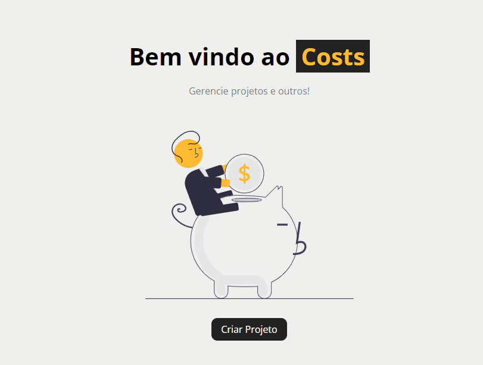

# Projeto Costs(um sistema de controle de projetos)

## Scripts disponíveis 

No diretório do projeto, você pode executar:

### `npm run backend`

Para executar o db.json

### `npm start`

Para iniciar o projeto
abra [http://localhost:3000](http://localhost:3000) para visualizar no seu navegador

### Projeto Costs foi idealizado por 
Matheus Battisti, do canal Hora de codar

###`Encontrará neste projeto:`

Um sistema de controle de projetos(que poderia ser fácilmente adaptado para um controle de usuários)
com funções de adicionar projetos, editar projetos após criados, adicionar serviços, excluir serviços e projetos
com verificações de que se o custo do serviço é maior que o orçamento total do projeto, se todos os campos estão preenchidos
entre outros!...

###`Tela de home:`

